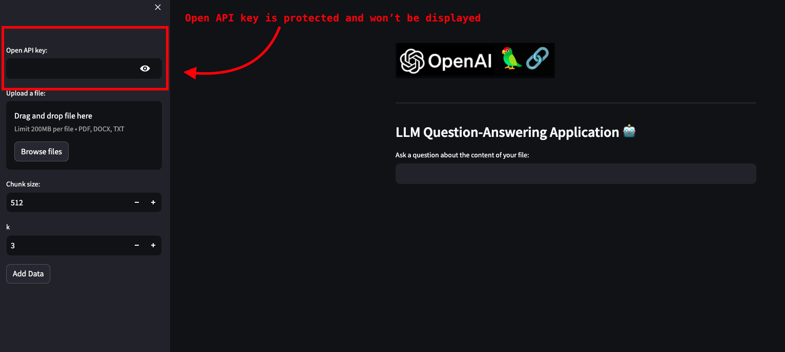

# personal-document-agent

A personalized chat bot agent to answer questions about your uploaded document.

How to run this project ?

### Setup
1. Run ```pip install -r requirements.txt```
2. Run ```streamlit run ./chat_with_documents.py```

### Approach #1
1. Add .env file after you clone this project.
2. Paste the below code and add the values for your 
    ```
    OPENAI_API_KEY=""
    PINECONE_API_KEY=""
    PINECONE_ENV=""
    ```
3. Run ```pip install -r requirements.txt```
4. Finally run ```streamlit run ./chat_with_documents.py```

### Approach #2
1. You can run the project and make sure to paste the Open Api key (as shown below)
</br>

